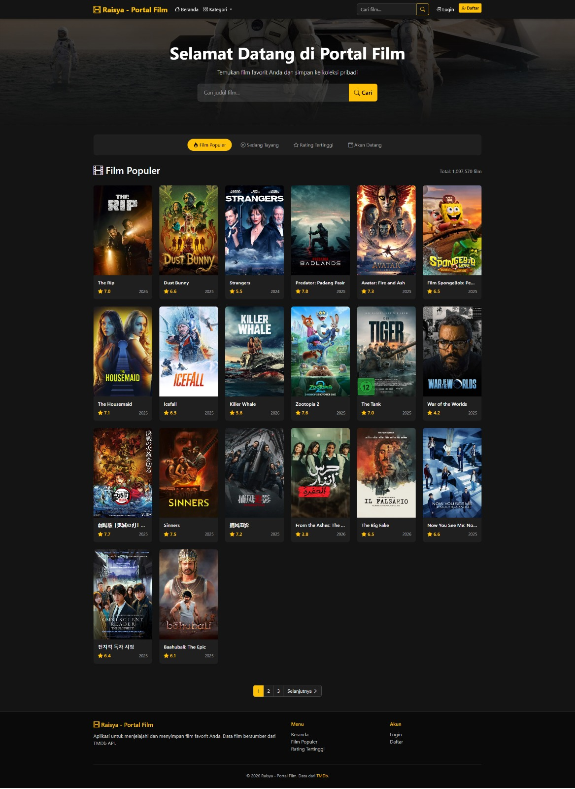
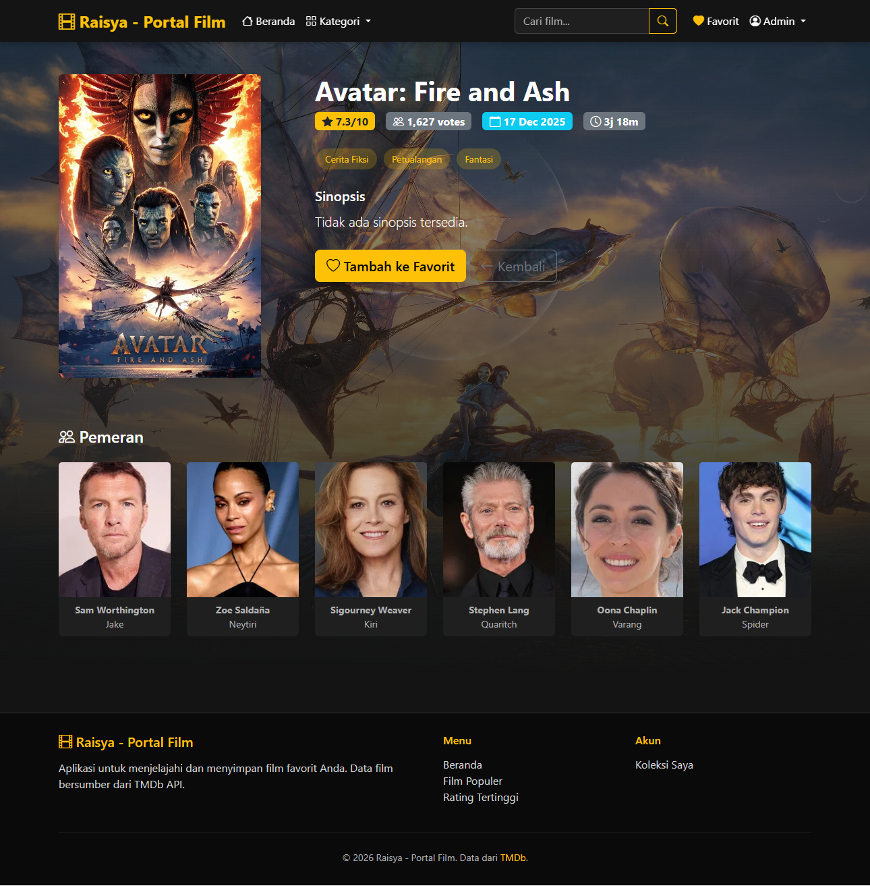
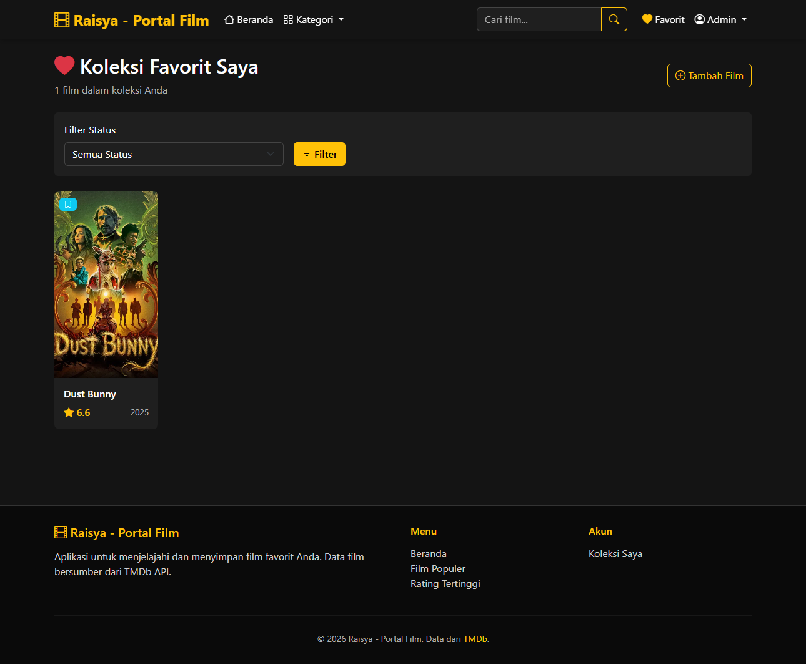
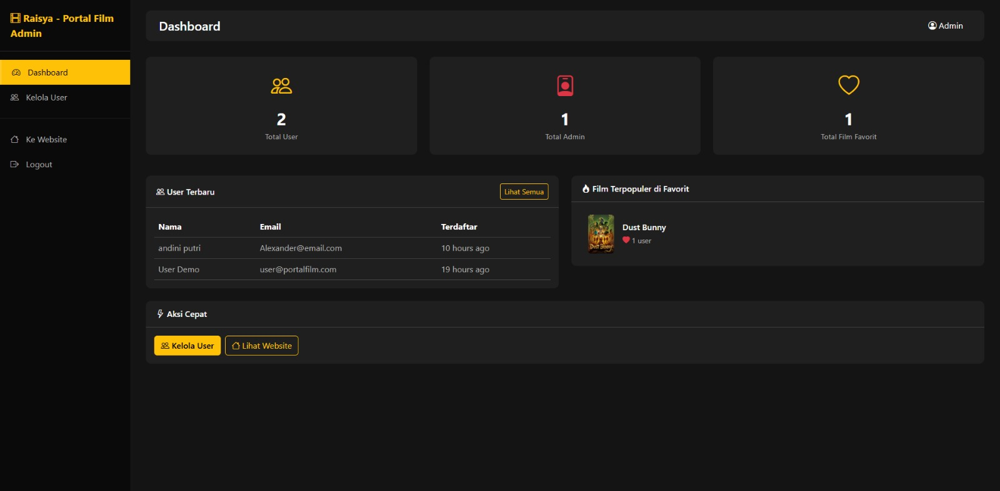

# Raisya - Portal Film

## Informasi Mahasiswa
- **Nama**: Raisya Agni Janatunnisa
- **NIM**: 2307011

## Deskripsi Aplikasi

Portal Film adalah aplikasi web berbasis Laravel yang memungkinkan pengguna untuk menjelajahi dan menyimpan film favorit. Aplikasi ini terintegrasi dengan **TMDb (The Movie Database) API** untuk menampilkan informasi film terkini dan terpopuler.

### Fitur Utama:
- 🎬 **Jelajahi Film** - Lihat film populer, sedang tayang, rating tertinggi, dan yang akan datang
- 🔍 **Pencarian Film** - Cari film berdasarkan judul
- 🏷️ **Filter Genre** - Telusuri film berdasarkan genre
- ❤️ **Koleksi Favorit** - Simpan film favorit ke dalam koleksi pribadi
- 📝 **Catatan Pribadi** - Tambahkan catatan dan rating untuk setiap film favorit
- 👥 **Multi-User System** - Sistem autentikasi dengan role Admin dan User
- 🔐 **Data Isolation** - Setiap user hanya dapat mengakses data miliknya sendiri

## Teknologi yang Digunakan

| Teknologi | Versi | Keterangan |
|-----------|-------|------------|
| PHP | ^8.1 | Bahasa pemrograman |
| Laravel | ^10.x | PHP Framework |
| MySQL | ^5.7 / ^8.0 | Database |
| Bootstrap | 5.3.2 | CSS Framework |
| TMDb API | v3 | Sumber data film |

## Persyaratan Sistem

- PHP >= 8.1
- Composer
- MySQL >= 5.7
- TMDb API Key (gratis)

## Panduan Instalasi

### 1. Clone Repository

```bash
git clone https://github.com/raisyaica/portal-film.git
cd portal-film
```

### 2. Install Dependencies

```bash
composer install
```

### 3. Konfigurasi Environment

```bash
# Copy file .env.example
cp .env.example .env

# Generate application key
php artisan key:generate
```

### 4. Konfigurasi Database

Edit file `.env` dan sesuaikan konfigurasi database:

```env
DB_CONNECTION=mysql
DB_HOST=127.0.0.1
DB_PORT=3306
DB_DATABASE=portal_film
DB_USERNAME=root
DB_PASSWORD=
```

Buat database MySQL:

```sql
CREATE DATABASE portal_film CHARACTER SET utf8mb4 COLLATE utf8mb4_unicode_ci;
```

### 5. Konfigurasi TMDb API

1. Daftar akun di [TMDb](https://www.themoviedb.org/signup)
2. Dapatkan API Key di [TMDb API Settings](https://www.themoviedb.org/settings/api)
3. Update file `.env`:

```env
TMDB_API_KEY=your_api_key_here
TMDB_BASE_URL=https://api.themoviedb.org/3
TMDB_IMAGE_BASE_URL=https://image.tmdb.org/t/p
```

### 6. Jalankan Migration & Seeder

```bash
# Jalankan migration
php artisan migrate

# Jalankan seeder (membuat akun demo)
php artisan db:seed
```

### 7. Jalankan Aplikasi

```bash
php artisan serve
```

Akses aplikasi di: `http://localhost:8000`

## Akun Demo

Setelah menjalankan seeder, tersedia akun demo berikut:

| Role | Email | Password |
|------|-------|----------|
| Admin | admin@portalfilm.com | password123 |
| User | user@portalfilm.com | password123 |

## Struktur Fitur

### Halaman Publik (Tanpa Login)
- Beranda dengan film populer
- Kategori film (Popular, Now Playing, Top Rated, Upcoming)
- Filter berdasarkan genre
- Pencarian film
- Detail film lengkap

### Fitur User (Setelah Login)
- Tambah film ke favorit
- Kelola koleksi favorit
- Update status menonton (Ingin Ditonton, Sedang Ditonton, Sudah Ditonton)
- Tambah catatan pribadi
- Beri rating film

### Fitur Admin
- Dashboard statistik
- Kelola user
- Lihat aktivitas user

## Struktur Database

### Tabel `users`
| Kolom | Tipe | Keterangan |
|-------|------|------------|
| id | bigint | Primary key |
| name | varchar | Nama user |
| email | varchar | Email (unique) |
| password | varchar | Password (hashed) |
| role | enum | 'admin' atau 'user' |
| timestamps | | created_at, updated_at |

### Tabel `favorite_films`
| Kolom | Tipe | Keterangan |
|-------|------|------------|
| id | bigint | Primary key |
| user_id | bigint | Foreign key ke users |
| tmdb_id | bigint | ID film dari TMDb |
| title | varchar | Judul film |
| poster_path | varchar | Path poster |
| vote_average | float | Rating TMDb |
| personal_note | text | Catatan user |
| watch_status | enum | Status menonton |
| rating | tinyint | Rating user (1-10) |
| timestamps | | created_at, updated_at |

## Screenshot Aplikasi

### Halaman Beranda

*Tampilan halaman beranda dengan daftar film populer*

### Detail Film

*Tampilan detail film dengan informasi lengkap*

### Koleksi Favorit

*Halaman koleksi film favorit user*

### Dashboard Admin

*Dashboard admin dengan statistik*

> **Catatan**: Folder `screenshots/` perlu dibuat dan diisi dengan screenshot aktual dari aplikasi.

## API Endpoints

| Method | Endpoint | Keterangan |
|--------|----------|------------|
| GET | / | Halaman beranda |
| GET | /search?q={query} | Pencarian film |
| GET | /genre/{id} | Filter berdasarkan genre |
| GET | /film/{id} | Detail film |
| GET | /favorites | Koleksi favorit user |
| POST | /favorites | Tambah ke favorit |
| PUT | /favorites/{id} | Update favorit |
| DELETE | /favorites/{id} | Hapus dari favorit |
| GET | /admin/dashboard | Dashboard admin |
| GET | /admin/users | Kelola user |

## Keamanan

- ✅ Password di-hash menggunakan bcrypt
- ✅ CSRF protection pada semua form
- ✅ Middleware auth untuk route protected
- ✅ Data isolation - user hanya akses data sendiri
- ✅ Role-based access control (RBAC)

## Troubleshooting

### Error: "TMDB API Key not configured"
Pastikan Anda sudah mengisi `TMDB_API_KEY` di file `.env`

### Error: "Connection refused" saat akses database
- Pastikan MySQL/MariaDB sudah berjalan
- Periksa konfigurasi database di `.env`
- Pastikan database sudah dibuat

### Error: "Class not found"
```bash
composer dump-autoload
php artisan config:clear
php artisan cache:clear
```

## Lisensi

Aplikasi ini dibuat untuk keperluan tugas kuliah.

## Referensi

- [Laravel Documentation](https://laravel.com/docs)
- [TMDb API Documentation](https://developers.themoviedb.org/3)
- [Bootstrap 5 Documentation](https://getbootstrap.com/docs/5.3)
